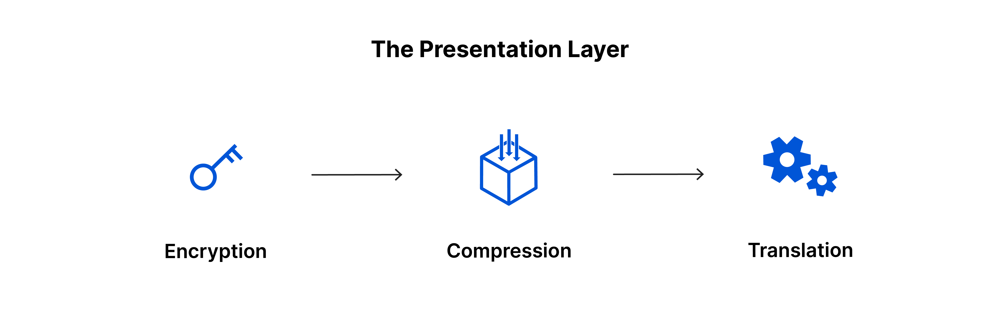

# osi-layer

<b>Nama</b> : Fasihul Ilmi  
<b>NRP</b> : 3122600027  
<b>Kelas</b> : 2 D4 Teknik Informatika A  
<b>Mata Kuliah</b> : Konsep Jaringan  
## Pengertian OSI Layer
Open System Interconnection atau OSI adalah model referensi yang diciptakan dari sebuah kerangka yang bersifat konseptual. Namun, saat ini telah berkembang dan menjadi sebuah standarisasi khusus berkaitan dengan koneksi komputer.

Tujuan dari pembuatan OSI Layer adalah menjadi model rujukan bagi setiap vendor atau developer sehingga produk atau perangkat lunak yang dibuat memiliki sifat interpolate. Yang berarti, user dapat melakukan kerja sama dengan produk atau sistem tanpa perlu melakukan penanganan secara khusus atau special.
 
 

<i>Open System Interconnection</i>

 

## Fungsi OSI Layer

Pengembangan konsep lapisan OSI sebenarnya ditujukan untuk memungkinkan pembuat PC, jaringan, dan pengembang perangkat lunak guna membuat produk yang dapat mereka sambungkan tanpa adanya usaha tambahan. Dalam prosesnya, pembuat PC dan pengembang jaringan Internet tidak mempraktikkan protokol model tingkat OSI secara default. Alasannya adalah tidak semua proses komunikasi memerlukan langkah-langkah lapisan OSI karena protokol yang lebih sederhana dapat digunakan.

Lapisan OSI bekerja melalui prosedur sekuensial 7 lapisan. Jika Anda tidak memiliki akses internet di laptop Anda, itu berarti Anda mungkin memiliki masalah di setiap tingkat prosedur. Konsep tingkat OSI menyederhanakan proses menemukan titik jatuh awal, sehingga mengurangi waktu yang diperlukan untuk melacak masalah jaringan. Ini membuat pemecahan masalah jaringan lebih mudah dan lebih cepat.

## 7 Lapisan OSI Layer

Berikut ini merupakan tujuh model OSI Layer, yang mana pada setiap lapisan mempunyai tugas dan fungsi masing-masing sesuai dengan penggunaannya terkait dengan kebutuhan koneksi antar perangkat komputer.

<b>1. Physical Layer</b>
 
 

 
 
Model OSI Layer yang paling utama adalah physical layer. Fungsinya adalah untuk mendefinisikan media transmisi jaringan, sinkronisasi bit, metode pensinyalan, serta membangun arsitektur jaringan seperti Ethernet, pengkabelan, dan topologi jaringan.

Pada tahapan atau level ini juga mendefinisikan mengenai bagaimana sebuah NIC (Network Interface Card) dapat berinteraksi secara langsung dengan media kabel dan perangkat radio. Untuk setiap pengiriman data melalui tiap layer, dapat dianalogikan seperti anda mengirim surat.

Proses dalam data biner dikodekan dalam bentuk yang mampu ditransmisi melalui media jaringan. Contohnya adalah transceiver, konektor, dan kabel yang terkait dengan physical layer. Contoh lain dari peralatan atau perangkat pada lapisan 1 ini adalah hub, repeater, dan network card.

 
<b>2. Data Link Layer </b>
 
 

 
 
Pada data-link layer memiliki tugas untuk menentukan setiap bit data dikelompokkan menjadi format yang disebut dengan frame. Pada level ini juga terjadi koreksi kesalahan, flow control, pengalamatan hardware atau perangkat keras (seperti halnya pada MAC Address (Media Access Control Address)). 

Serta, menentukan bagaimana perangkat jaringan seperti hub, repeater, bridge, dan switch pada layer 2 dapat beroperasi. Untuk spesifikasi IEEE 802, dapat membagi tingkatan menjadi 2 level, yaitu lapisan Media Access Control (MAC) dan lapisan Logical Link Control (LLC).

Fungsi dari LLC adalah mampu menyiapkan proses transimi kembali dari kegagalan paket saat terindikasi. Selain itu, fungsi dari lapisan MAC adalah mampu mengkoordinasikan proses akses langsung terhadap physical layer dengan metode media akses kontrolnya. Contoh dari MAC sendiri adalah Carrier Sense Multiple Access with Collision Detection (CSMA/CD), dan Carrier Sense Multiple Access with Collision Avoidance (CSMA/CA).

- <b>CSMA/CD</b> adalah metode dalam Media Access Control (MAC) yang digunakan oleh jaringan pada Ethernet. Dengan menggunakan metode tersebut, sebuah node jaringan akan mengirim data menuju node tujuan yang mempunyai tugas untuk memastikan bahwa jaringan sedang tidak dipakai untuk kebutuhan transfer lainnya. Apabila dalam tahap pengecekan terjadi tabrakan (collision) antar transmisi, maka node diharuskan untuk mengulangi permohonan (request) pengiriman dalam selang waktu berikutnya secara acak (random). Sehingga, jaringan menjadi lebih efektif dan dapat digunakan secara bergantian.

- <b>CSMA/CA</b> adalah protokol contention dalam jaringan yang dapat melakukan proses analisa kondisi jaringan komputer, supaya dapat menghindari terjadinya collision. Tidak seperti metode CSMA/CD yang menggunakan konfigurasi transmisi jaringan saat terjadi tabrakan. CSMA/CA lebih mengonsumsi traffic karena sebelum proses transmisi data, akan melakukan pengiriman sinyal melalui broadcast pada jaringan untuk mendeteksi sebuah skenario atau kemungkinan terjadinya collision.

 
<b>3. Network Layer</b>
 
 

 
 
Tugas dari network layer adalah membuat header untuk paket yang berisi informasi IP (Internet Protocol), baik IP pengirim atau IP tujuan data. Pada suatu kondisi, network layer juga melakukan proses routing melalui internetworking dengan menggunakan bantuan router dan switch pada layer ke-3. 

 
<b>4. Transport Layer</b>
 
 

 
 
Transport layer mempunyai fungsi untuk memecah data menjadi paket-paket data, serta memberikan nomor urut untuk setiap paketnya. Sehingga, nantinya dapat disusun kembali saat sampai pada tujuan. Pada layer ini juga menentukan protokol yang akan digunakan untuk mentransmisikan data, seperti protokol TCP dan UDP.

Protokol tersebut akan mengirimkan paket data, sekaligus memastikan bahwa setiap paket telah diterima dengan sukses dan tepat sasaran. Selain itu, juga dapat mentransmisikan ulang terhadap paket yang hilang atau rusak ketika proses pengiriman.

Transport layer data dapat menyediakan transfer yang transparan dan reliable antara kedua titik akhir. Lapisan ini juga menyediakan proses multiplexing, kendali aliran (flow control), serta proses pemeriksaan error dan perbaikannya.

 
<b>5. Session Layer</b>
 
 

 
 
Session layer merupakan lapisan yang berfungsi untuk mendefinisikan bagaimana sebuah koneksi dapat dibuat, dikelola, dan dikembangkan. Contoh protokol yang berada pada session layer adalah NFS, SMB, RTP, dan lain-lain.

Contoh lain dalam beberapa protokol model ini antara lain:
- <b>NETBIOS</b> adalah suatu session pada interface dan protokol yang dikembangkan langsung oleh IBM, serta menyediakan layanan menuju presentation layer dan application layer
- <b>NETBEUI (NETBIOS Extended User Interface)</b> adalah fase pengembangan dari NETBIOS yang digunakan untuk kebutuhan produk Microsoft Networking, contohnya Windows NT dan LAN Manager;
- <b>ADSP</b> (AppleTalk Data Stream Protocol);
- <b>PAP</b> (Printer Access Protocol) adalah mekanisme yang terdapat dalam printer Postscript untuk proses pengaksesan pada jaringan AppleTalk.

 
<b>6. Presentation Layer</b>
 
 

 
 
Lapisan yang keenam adalah presentation layer, dimana mempunyai fungsi untuk mentranslasikan format data yang akan ditransmisikan oleh aplikasi melalui jaringan, ke dalam format yang dapat ditransmisikan oleh sebuah jaringan.

Pada layer ini, data juga akan ter-enkripsi dan dekripsi melalui sistem. Contoh protokol yang berada pada presentation layer adalah MIME, SSL (Socket Secure Layer), TLS, Redirector Software (contohnya Windows NT, Network Shell, atau Remote Desktop Protocol (RDP)), dan lain sebagainya.

 
<b>7. Application Layer</b>
 
 

 
 
Application layer adalah lapisan yang menjadi pusat (center) terjadinya suatu interaksi antara pengguna (end user) dengan aplikasi yang bekerja menggunakan fungsionalitas sebuah jaringan. Selain itu juga mempunyai fungsi untuk melakukan konfigurasi mengenai bagaimana cara aplikasi dapat bekerja menggunakan resource jaringan.

Dan kemudian, dapat memberikan pesan saat terjadi sebuah kesalahan pada proses pengaturan jaringan. Contoh beberapa services dan protokol yang berada pada application layer adalah HTTP, SMTP, FTP (File Transfer Protocol), NFS, dan lain-lain.

## Cara Kerja OSI Layer

Untuk memahami cara kerja dari OSI Layer sendiri, anda dapat membayangkan dengan tahapan dalam mengirim surat. Agar surat sampai kepada penerima dengan baik dan tepat, maka harus melewati berbagai tahapan pengiriman sesuai dengan prosedur yang telah ditetapkan sebelumnya. Berikut ini merupakan beberapa penjelasan mengenai cara kerja OSI Layer.

- <b>Pertama</b>, Application layer akan mengirimkan data dari pengguna ke perangkat komputer penerima data.
- <b>Kedua</b>, pada presentation layer terjadi konversi email menjadi sebuah format jaringan.
- <b>Ketiga</b>, pada session layer akan membentuk sesi perjalanan data hingga seluruh proses pengiriman data selesai dilaksanakan.
- <b>Keempat</b>, di dalam transport layer pengirim melakukan pemecahan data. Kemudian, data tersebut dikumpulkan pada transport layer penerima.
- <b>Kelima</b>, network layer membuat alamat sehingga dapat menuntut  dan mengarahkan data pada tujuan yang benar.
Pada data-link layer akan terbentuk data dalam bentuk frame, serta alamat fisik. 
Pada lapisan utama, tepatnya physical layer, data akan dikirim melalui medium (perantara) jaringan menuju lapisan transport penerima. 
- <b>Terakhir</b>, alur proses akan berbalik dari physical layer menuju application layer. Nantinya akan mengarah pada jaringan komputer penerima.
Itulah tadi informasi mengenai 7 model OSI layer yang terdiri atas: application, presentation, session, transport, network, data-link, dan physical layer. Tentunya, tiap lapisan memiliki kegunaan masing-masing. Menarik sekali ya pembahasan tentang OSI layer ini? Simak pembahasan menarik lainnya di artikel selanjutnya.