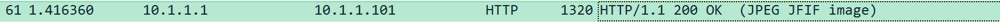
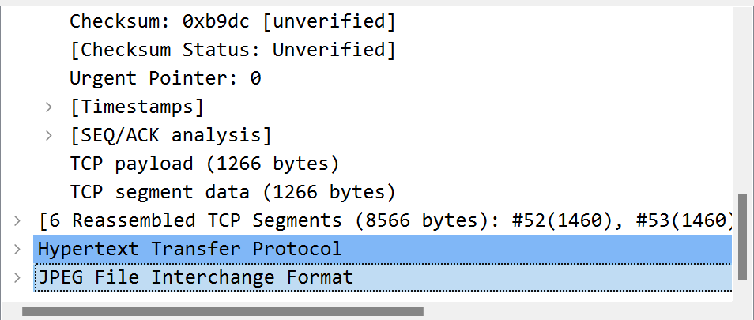
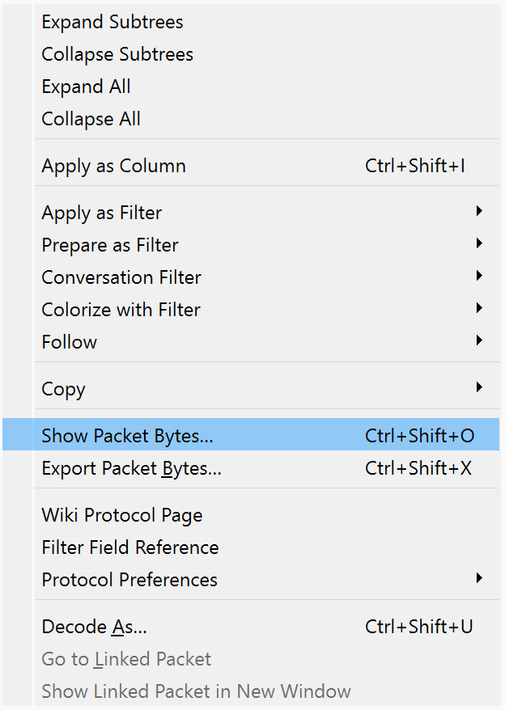
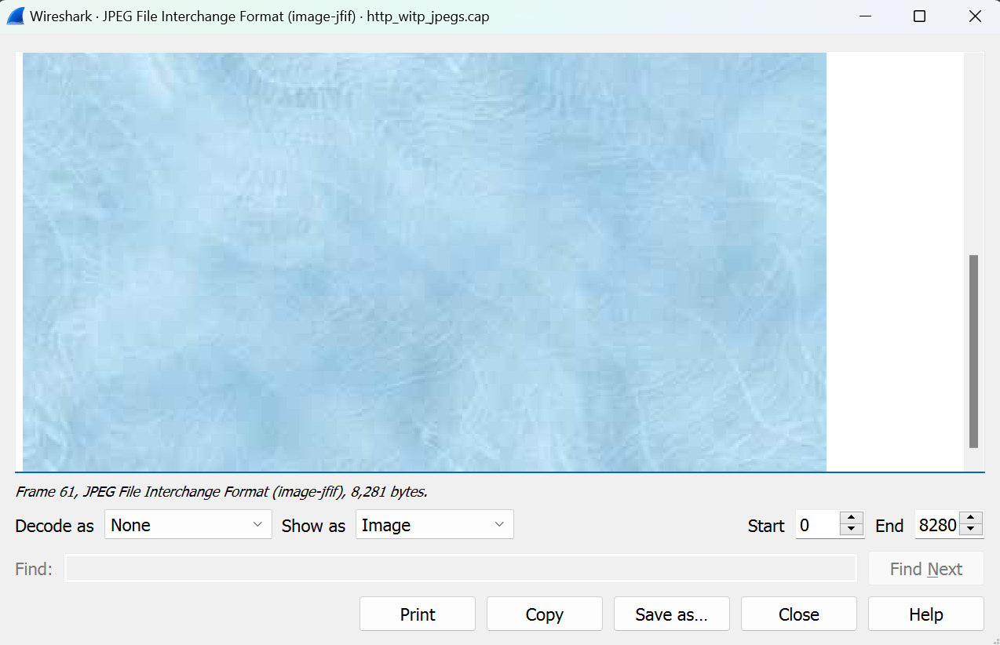
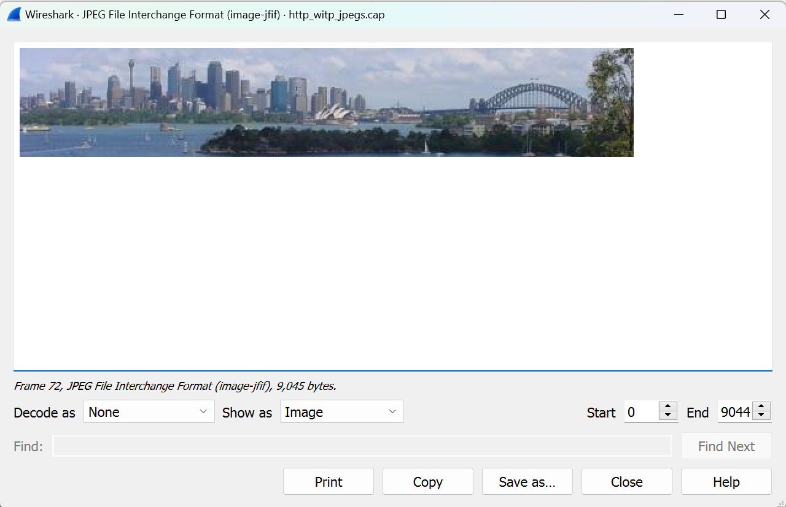
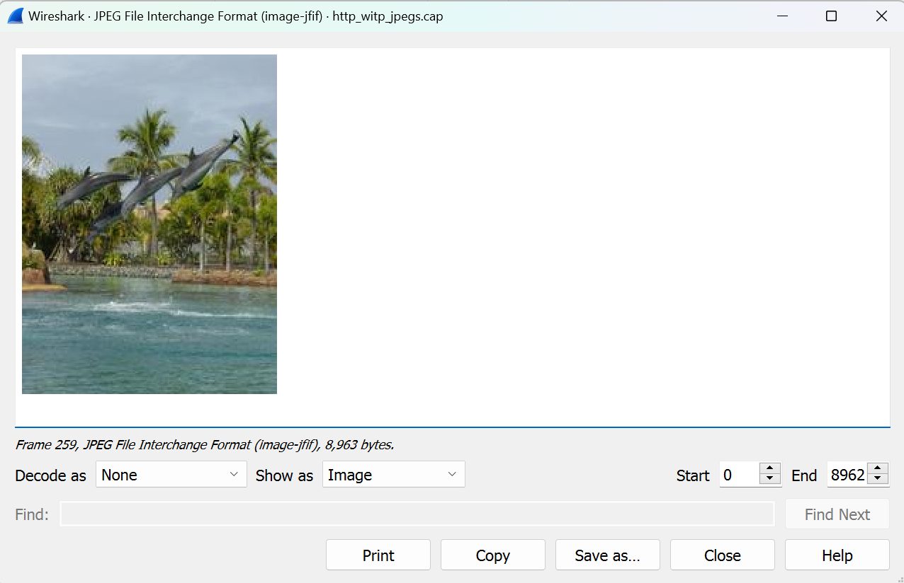
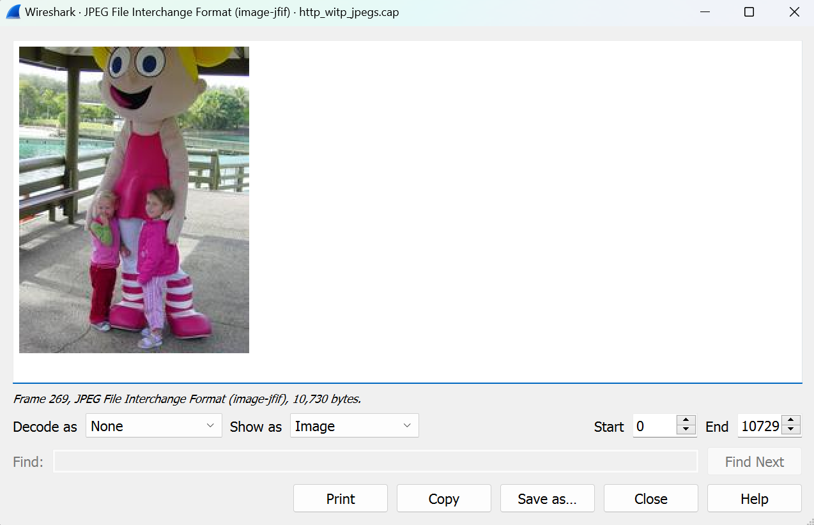
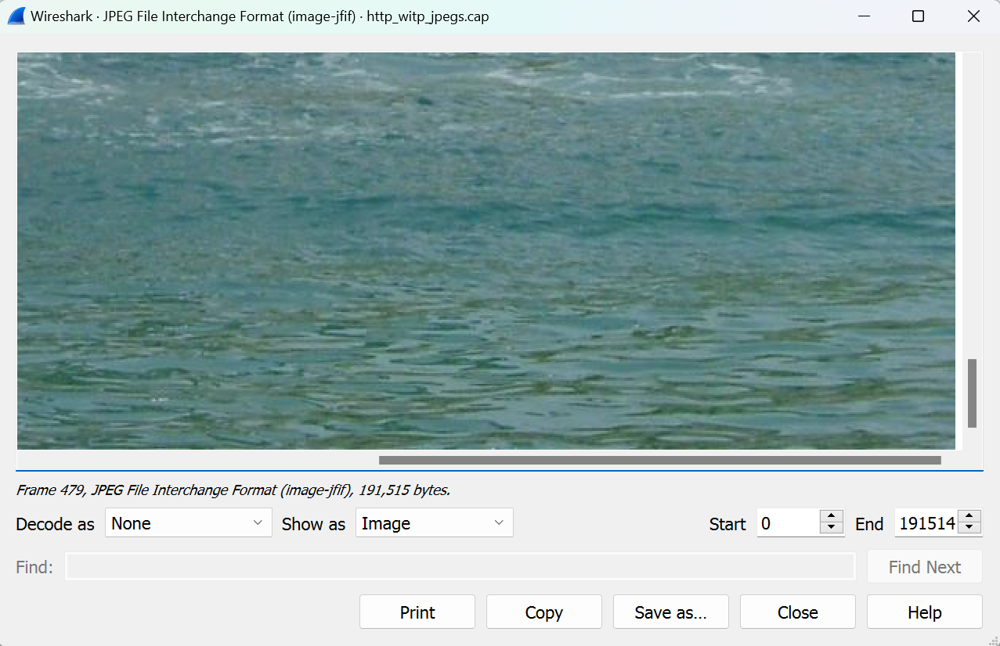

## Mengakses Packet Gambar pada HTTP

**1. Buka file sample http_with_jpegs.cap menggunakan Wireshark dan filter HTTP** 

**2. Cari packet yang memiliki info "200 OK (JPEG JFIF image)"**

**3. Pilih paket tersebut dan klik kanan pada  "JPEG file interchange format" yang terletak pada window di bagian kiri bawah, lalu pilih "Show Packet Bytes..."**

**4. Wireshark akan menampilkan gambar yang terdapat pada packet tersebut**

---

Terdapat lima packet yang memuat data gambar pada sampel file tersebut. Berikut adalah gambar-gambar yang dimuat pada lima packet tersebut.

 
<i>Packet No. 72</i>

 

 
<i>Packet No. 259</i>

 

 
<i>Packet No. 269</i>

 

 
<i>Packet No. 479</i>

