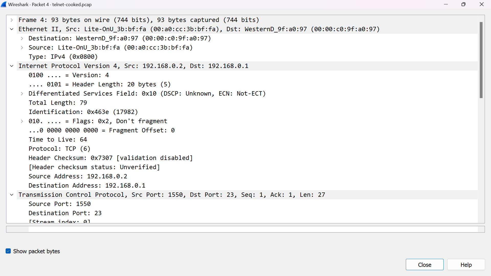

# Analisis Telnet dan DNS Cap

## 1. Analisis Telnet
Telnet adalah  protokol  jaringan yang memungkinkan akses  jarak jauh dan kontrol perangkat di jaringan. Biasanya, Telnet digunakan untuk menyambung ke lingkungan shell atau  baris perintah pada perangkat seperti server jarak jauh atau router yang  mendukung  jaringan.

 Saat digunakan, Telnet memungkinkan pengguna untuk terhubung ke perangkat jarak jauh dan berinteraksi dengan sistem  seolah-olah mereka sedang berdiri di depannya. Pengguna dapat memasukkan perintah, menjalankan program dan melihat output dari perangkat jarak jauh ini melalui koneksi Telnet.

 
 Dari sana, kita dapat menentukan alamat IP pengguna (192.168.0.2) dan alamat IP server/PC yang dihubungi dari jarak jauh (192.168.0.1), serta port yang digunakan oleh pengguna (1550.) dan server /PC dihubungi. (23) melalui TCP untuk layanan Telnet.

 Di Wireshark kita dapat memantau aliran TCP atau apa yang terjadi di protokol. Garis merah menunjukkan data yang dikirimkan oleh pengguna (yang sedang mengakses server/remote PC), sedangkan garis biru menunjukkan respon dari server/PC yang dihubungi.

 ## 2. Analisis DNS

 
DNS, atau Domain Name System, adalah sistem yang digunakan dalam jaringan komputer untuk menerjemahkan nama domain yang mudah diingat menjadi alamat IP numerik yang digunakan oleh komputer dan server untuk berkomunikasi satu sama lain di Internet. DNS memainkan peran penting dalam pengalaman berselancar di web, karena memungkinkan kita untuk mengakses situs web dan layanan online dengan menggunakan nama yang mudah diingat, seperti www.google.com, alih-alih harus mengingat alamat IP numerik yang rumit.

Keterangan tambahan dan parafrase: Dari data yang diberikan, kita bisa mengetahui alamat IP internet yang digunakan oleh klien dan server (klien: 192.168.170.8, server: 192.168.170.20), serta port yang dipakai oleh klien (32795) dan server (53).