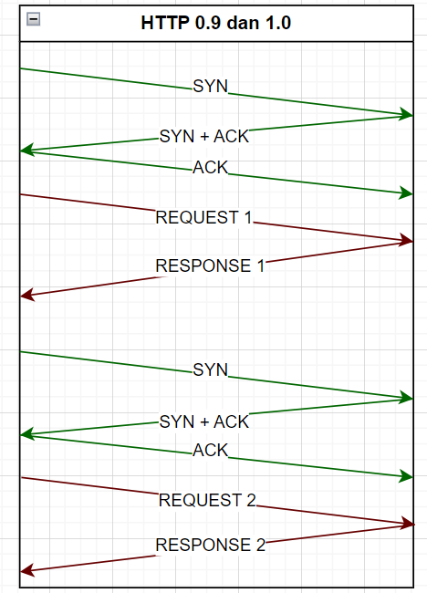
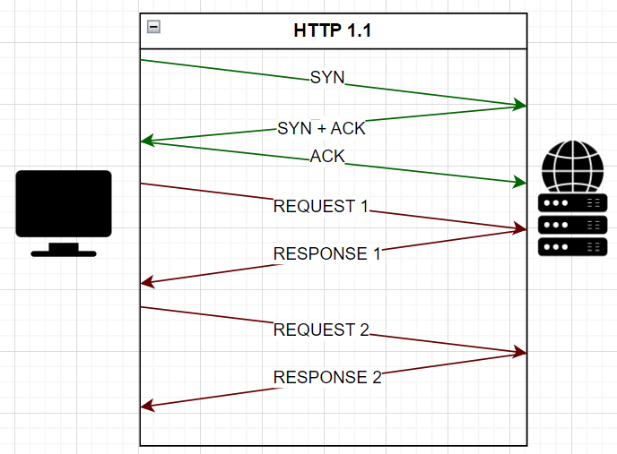

# Membandingkan Setiap Versi HTTP

### 1. HTTP 0.9

**Tahun Rilis** : HTTP/0.9 dirilis sekitar tahun 1991, menjadikannya salah satu versi paling awal dari HTTP.

**Karakteristik**: 
- HTTP/0.9 sangat sederhana dan hanya mendukung satu jenis permintaan: GET.
- Protokol ini tidak memiliki header HTTP, tidak ada header permintaan, dan tidak ada header respons. Hanya terdapat satu jenis pesan, yaitu respons dengan konten HTML mentah.

**Kelebihan**: 
- Simplicity: HTTP/0.9 sangat mudah dipahami dan diimplementasikan karena kurangnya kompleksitas seperti header HTTP dan jenis permintaan lainnya.
- Efisien untuk aplikasi yang sangat sederhana dan membutuhkan komunikasi minimal.

**Keterbatasan**: 
- Terlalu sederhana: Karena keterbatasannya yang besar, HTTP/0.9 tidak cocok untuk aplikasi web modern yang memerlukan fitur-fitur seperti autentikasi, header kustom, jenis permintaan yang beragam, dan sebagainya.
- Tidak aman: Tidak ada dukungan untuk keamanan atau enkripsi pada HTTP/0.9, yang membuatnya tidak cocok untuk pertukaran data sensitif.

### 2. HTTP 1.0

**Tahun Rilis**: HTTP/1.0 didefinisikan pada tahun 1996.

**Karakteristik**:
- Protokol awal untuk World Wide Web.
- Sifatnya stateless, artinya setiap permintaan dianggap independen satu sama lain.

**Kelebihan**:
- Sederhana dan mudah diimplementasikan.
- Cocok untuk situasi di mana konten web statis dominan.

**Keterbatasan**:
- Performanya terbatas karena setiap permintaan membuka dan menutup koneksi TCP yang berlebihan.
- Tidak efisien dalam mengirimkan konten dinamis.

### 3. HTTP 1.1

**Tahun Rilis**: HTTP/1.1 diperkenalkan pada tahun 1997 sebagai penyempurnaan dari HTTP/1.0.

**Karakteristik**:
- Memperkenalkan reusing connections (menggunakan kembali koneksi) untuk mengatasi masalah kinerja HTTP/1.0.
- Dukungan header persistensi (persistent headers) untuk mengurangi overhead.

**Kelebihan**:
- Meningkatkan performa melalui keep-alive connections dan header persistensi.
- Dukungan untuk pipelining memungkinkan beberapa permintaan dikirim tanpa menunggu respons.

**Keterbatasan**:
- Masih memiliki beberapa masalah performa terutama untuk mengakses banyak sumber daya.

### 3. HTTP 1.1

**Tahun Rilis**: HTTP/1.1 diperkenalkan pada tahun 1997 sebagai penyempurnaan dari HTTP/1.0.

**Karakteristik**:
- Memperkenalkan reusing connections (menggunakan kembali koneksi) untuk mengatasi masalah kinerja HTTP/1.0.
- Dukungan header persistensi (persistent headers) untuk mengurangi overhead.

**Kelebihan**:
- Meningkatkan performa melalui keep-alive connections dan header persistensi.
- Dukungan untuk pipelining memungkinkan beberapa permintaan dikirim tanpa menunggu respons.

**Keterbatasan**:
- Masih memiliki beberapa masalah performa terutama untuk mengakses banyak sumber daya.

### 4. HTTP 2.0

**Tahun Rilis**: HTTP/2 diperkenalkan pada tahun 2015.

**Karakteristik**:
- Menggunakan teknologi multiplexing untuk mengirim beberapa permintaan dan respons secara bersamaan melalui satu koneksi.
- Menggunakan kompresi header untuk mengurangi overhead.

**Kelebihan**:
- Meningkatkan kinerja dengan mengurangi latensi dan overhead.
- Mendukung prioritas, yang memungkinkan aplikasi untuk mengatur prioritas permintaan.

**Keterbatasan**:
- Memerlukan dukungan server dan browser yang kompatibel untuk memanfaatkan semua fitur HTTP/2.

### Perbedaan TCP keep-alive dan overflow

TCP Keep-Alive dan Flow Control adalah dua konsep yang berbeda dalam protokol Transmission Control Protocol (TCP) yang digunakan untuk mengelola komunikasi jaringan. Berikut adalah perbedaan antara keduanya:

***TCP Keep-Alive***:

**Tujuan**: 

TCP Keep-Alive digunakan untuk mempertahankan koneksi TCP aktif antara dua perangkat yang terhubung, meskipun tida**k ada data yang dikirim antara mereka. Ini berguna untuk memastikan bahwa koneksi tetap hidup dan tidak mati secara otomatis jika tidak ada aktivitas data selama periode waktu tertentu.

**Penggunaan**: 

Ini digunakan untuk menjaga koneksi tetap terbuka dan tidak terputus secara otomatis oleh firewall, router, atau perangkat jaringan lainnya yang mungkin memiliki kebijakan untuk mengakhiri koneksi yang tidak aktif.
**Pengaturan**: 

Server atau klien dapat mengirim pesan Keep-Alive secara periodik ke pihak lain untuk memeriksa apakah koneksi masih hidup. Jika pihak lain tidak merespons pesan Keep-Alive dalam jangka waktu tertentu, koneksi dapat dianggap mati dan ditutup.

***Flow Control (Kontrol Aliran)***:

**Tujuan**: 

Flow control adalah mekanisme dalam TCP yang digunakan untuk mengendalikan aliran data antara pengirim dan penerima agar tidak terlalu cepat atau terlalu lambat. Ini mencegah pengirim yang lebih cepat mengirim data daripada yang dapat diproses oleh penerima.
Penggunaan: Flow control digunakan untuk menghindari situasi di mana pengirim melimpahkan terlalu banyak data ke penerima, yang dapat mengakibatkan tumpukan data (buffer overflow) atau pengiriman yang tidak efisien.

**Pengaturan**:

 Flow control biasanya diatur dengan menggunakan window size (ukuran jendela) dalam TCP. Penerima mengirimkan informasi kepada pengirim tentang berapa banyak data yang dapat mereka terima sekaligus. Pengirim kemudian mengirimkan data sesuai dengan batasan ini, mengendalikan aliran data.
 
Jadi, perbedaan utama antara TCP Keep-Alive dan Flow Control adalah bahwa TCP Keep-Alive digunakan untuk menjaga koneksi tetap hidup dengan mengirim pesan sederhana secara berkala, sedangkan Flow Control adalah mekanisme yang mengendalikan aliran data antara pengirim dan penerima untuk memastikan efisiensi dalam proses pengiriman data. Kedua konsep ini memiliki tujuan yang berbeda dan diimplementasikan dengan cara yang berbeda dalam protokol TCP.